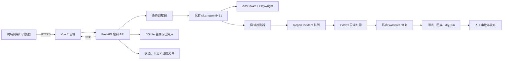

# Amazon 5461 内网控制台与 Codex 自动修复可行性研究及执行计划

> 文档状态：待执行  
> 创建日期：2026-08-04  
> 适用仓库：`C:\Users\Admin\Documents\Amazon-5461-bot`  
> 目标环境：公司局域网、Windows 执行主机、AdsPower、Playwright  
> 默认运行策略：只读诊断或 dry-run；任何真实提交仍需明确授权

## 0. 可行性研究

### 0.1 研究问题

本次研究回答以下问题：

1. 能否为现有 Amazon 5461 自动化增加一个公司局域网 Web 控制台，使日常操作不依赖直接与 Codex 对话。
2. 能否复用现有 Python、Playwright、AdsPower、SQLite、日志和证据体系，而不是重写自动化。
3. 能否安全地从页面异常自动判断“疑似 Amazon 页面改版”。
4. 能否自动调用 Codex 诊断并修改现有代码，使其适配新页面。
5. 哪些步骤可以无人值守，哪些步骤必须保留人工批准。
6. 实施该系统需要补齐哪些工程、安全和运维能力。

### 0.2 研究结论

总体可行性评估：**高，建议实施**。

推荐建设方式是“给现有自动化增加控制面和修复流水线”，而不是重写自动化内核：

- 内网控制台：技术可行性高。
- 诊断、dry-run、日志、证据、Case 和 Dashboard 状态可视化：技术可行性高。
- 真实提交经权限和二次确认后由网页触发：技术可行性高，但风险较高，必须延后开放。
- 页面结构异常自动检测：技术可行性高，但需要规则、基线和排除项避免误报。
- Codex自动判因和生成补丁：技术可行性中高，适合隔离运行。
- Codex补丁自动测试：技术可行性高，但需要补充页面 fixture 和契约测试。
- Codex补丁自动发布并继续真实提交：不建议实施；业务和账号风险不可接受。

可实现的安全目标是：

```text
自动发现
  -> 自动收集脱敏证据
  -> 自动调用 Codex 判因
  -> 自动生成隔离补丁
  -> 自动测试
  -> 人工批准发布
```

而不是：

```text
发现异常 -> Codex直接修改生产代码 -> 自动继续真实提交
```

### 0.3 调研范围与方法

本次可行性研究采用只读方式完成，未启动真实 Seller Central 提交。调研内容包括：

- 阅读 `AGENTS.md`、`PROJECT.md` 和 `docs/CURRENT_STATE.md`。
- 检查稳定 CLI、批次脚本、状态同步、SQLite schema、Case follow-up 和 Codex signal。
- 检查运行状态文件、后台进程 metadata 和证据目录结构。
- 只统计私有账号配置数量，不读取或输出完整账号记录。
- 检查 selector、Shadow DOM、状态循环和已知故障处理方式。
- 验证当前测试基线。
- 核对 Codex非交互模式、SDK、App Server、sandbox 和审批能力。
- 评估公司局域网、Windows执行主机、AdsPower和SQLite组合的部署方式。

### 0.4 当前系统盘点快照

调研时观察到的非秘密摘要：

| 项目 | 当前情况 |
|---|---:|
| 已配置账号 | 约 108 个 |
| 本地品牌包 | 29 个 |
| SQLite submissions | 30 行 |
| SQLite brand status snapshot | 56 行 |
| SQLite verifications | 81 行 |
| SQLite Case follow-up | 11 行 |
| SQLite procedure runs | 16 行 |
| SQLite unknown cases | 3 行 |
| 现有 Python 测试 | 17 项通过 |

这些数量只作为 2026-08-04 的调研快照，不应被硬编码到前端或业务逻辑。

现有资产已经覆盖：

- 账号、站点和品牌运行参数。
- AdsPower profile 映射。
- 诊断、dry-run、真实运行和 Case 检查入口。
- 批次状态、SQLite 台账和 Excel 登记逻辑。
- 截图、HTML snapshot、trace、日志和错误样本。
- Dashboard 和 Case 详情结果解释。
- 确定性恢复耗尽后的 Codex signal。

因此项目不缺“自动化内核”，主要缺少“统一控制、并发隔离、权限、审计和修复发布门禁”。

### 0.5 分项可行性评估

| 能力 | 可行性 | 主要依据 | 主要缺口 |
|---|---|---|---|
| 只读系统总览 | 高 | 状态、日志、SQLite和证据已落地 | 统一 read model、API、脱敏 |
| 任务历史和结果查询 | 高 | 已有 submissions、verifications、status snapshot | 状态来源需要统一优先级 |
| 实时日志和进度 | 高 | 已有独立 stdout/stderr 和 PID metadata | SSE、任务 ID、断线恢复 |
| 网页启动 diagnose/dry-run | 高 | 已有稳定 CLI | 白名单参数、子进程管理、profile 锁 |
| 网页启动真实提交 | 高但高风险 | CLI 已有显式 `--submit` 门禁 | 身份认证、二次确认、审计 |
| Case follow-up 可视化 | 高 | 已有持久队列和 worker | API、锁冲突显示、人工动作 |
| 页面异常自动识别 | 高 | 已有状态机、selector、evidence、unknown case | DOM契约、signature、误报控制 |
| Codex自动判因 | 高 | 已有 signal 和证据路径 | 持久队列、结构化输出、预算 |
| Codex自动生成补丁 | 中高 | Codex可非交互修改本地代码 | worktree隔离、文件 allowlist、测试 |
| Codex自动验证 | 中高 | 已有 pytest 和 dry-run | 页面 fixture、契约测试、canary |
| Codex自动发布 | 低，不建议 | 技术上可以合并代码 | 业务语义、隐私和真实提交风险 |
| 多机器分布式执行 | 中，非MVP | 可引入外部队列和数据库 | 当前 AdsPower/SQLite/Windows 为单机结构 |

### 0.6 用户价值与适用场景

控制台上线后，以下高频工作不再要求员工直接与 Codex 对话：

- 查看哪些任务正在运行、排队、失败或等待人工处理。
- 选择账号、站点和品牌执行预检、诊断或 dry-run。
- 经授权后发起明确范围的真实提交。
- 查看每品牌的状态、Case ID、Dashboard状态、截图和日志。
- 查看 Draft、无 Case ID、Under Review、Approved 和 Declined。
- 查看 Case follow-up 到期、重试和最终回复。
- 查看 CAPTCHA、2FA、登录过期、限流和账号风险事件。
- 查看疑似页面改版及 Codex 修复进度。
- 审核补丁 diff、测试和 canary 结果。

Codex仍需保留为二线工具处理：

- 新页面或新表单结构。
- selector和Shadow DOM重大变化。
- 状态识别或Case解析失效。
- 复杂证据冲突。
- 代码级修复、测试补充和diff审查。

### 0.7 技术方案比较

#### 方案 A：Vue 3 + FastAPI + 现有 Python 自动化

评估：**推荐**。

优点：

- 与现有 Python 代码、SQLite和 CLI 集成成本最低。
- 前端适合任务表格、筛选、日志流、证据查看和审批界面。
- TypeScript有利于维护复杂状态和API契约。
- 前端构建后可由同一内网服务提供，不要求生产机长期运行 Node开发服务器。

缺点：

- 需要维护前端构建工具和 API schema。
- 第一阶段工程量高于纯服务端模板。

#### 方案 B：FastAPI + Jinja/HTMX

评估：可用于快速PoC，但不推荐作为最终复杂控制台。

优点：

- 初始文件和构建步骤少。
- 只读总览可以很快完成。

缺点：

- 任务实时状态、筛选、长日志、审批中心和 Codex事件流逐渐复杂后维护成本上升。

#### 方案 C：Electron或Windows桌面应用

评估：不推荐。

原因：

- 每个员工终端都需要安装和升级。
- 不利于多用户访问、集中权限和审计。
- 不能自然解决单一 AdsPower 执行主机的调度问题。

#### 方案 D：部署到公网或普通云主机

评估：当前不推荐。

原因：

- AdsPower profile、浏览器会话和本地私有配置都在Windows执行主机。
- 会扩大账号、证据和提交接口的暴露面。
- 当前需求明确为公司局域网使用。

### 0.8 推荐部署模式的可行性

推荐一台 Windows 执行主机承担：

- AdsPower。
- Playwright 自动化。
- FastAPI。
- SQLite。
- 日志和证据存储。
- 自动化 worker 和 Codex repair worker。

员工通过局域网浏览器访问。

该模式可行的原因：

- 现有代码和运行资料已经以 Windows 本地路径为主。
- AdsPower本地 API 与浏览器 profile天然靠近执行主机。
- SQLite适合单主机、低到中等写并发的内部控制台。
- 自动化实际吞吐受 Seller Central、AdsPower profile 和限流约束，不需要高并发 Web 架构。

必须满足的条件：

- SQLite及其 WAL/SHM 文件保留在本机磁盘，不放网络共享盘。
- Web服务和自动化任务使用持久化状态，不依赖单个进程内存。
- 同一 AdsPower profile必须互斥。
- Windows 主机需要开机自启、进程重启、磁盘监控和备份。

### 0.9 数据可视化可行性

以下现有数据可以直接或经过轻量转换用于前端：

| 页面 | 数据来源 |
|---|---|
| 系统总览 | worker metadata、SQLite、AdsPower health、磁盘 |
| 任务列表 | batch state、process metadata、后续 automation_jobs |
| 每品牌结果 | batch item result、status summary、Dashboard结果 |
| 申请历史 | submissions、brand_status_snapshot、verifications |
| Case队列 | case_followups |
| 证据查看 | runtime/evidence、后续 evidence index |
| 待处理异常 | codex_signal、unknown_cases、日志分类 |
| Codex修复中心 | 后续 repair_incidents、codex_repair_jobs |

主要问题不是数据不存在，而是数据来源分散且优先级不同。实现前必须先建立统一 read model：

```text
Case最新Amazon回复
  > Dashboard当天检查
  > 明确Case ID和提交上下文
  > 本地batch_state
```

### 0.10 页面改版自动识别的可行性

可行，但不能用“单个selector找不到”作为唯一判断。

现有系统已经能提供：

- 当前 URL和页面标题。
- 可见文本和关键交互元素。
- selector和状态机匹配结果。
- 页面截图和错误样本。
- 连续状态不变次数。
- 确定性恢复是否耗尽。

在此基础上增加 DOM契约和incident signature，即可判断：

- 只是网络、登录、风控或Amazon服务端错误。
- 只是单账号/品牌限制。
- 某个fallback selector老化。
- Shadow DOM结构变化。
- 页面状态或导航流程变化。
- 表单业务语义发生重大变化。

主要限制：

- Amazon可能按账号、站点或时间灰度发布新UI。
- 动态广告、语言和可见文本会产生噪声。
- 页面业务语义变化不能仅由DOM差异安全决定。

因此建议第一次异常就生成incident并自动只读判因，但只有跨运行证据或高置信度分类后才生成补丁。

### 0.11 调用 Codex 修复的可行性

技术上可行，现有 `runtime/codex_signal.json` 已经证明系统能够在恢复耗尽时形成确定性本地交接。

可用集成方式：

1. `codex exec --json`：适合第一版，由Python后端作为非交互子进程调用。
2. Codex Python SDK：适合后续创建、继续和恢复修复线程。
3. Codex App Server：适合需要在前端显示完整事件、命令审批和文件修改审批的深度集成。

第一版选择 `codex exec --json` 的原因：

- 与当前 Python 子进程和日志模型一致。
- 可消费 JSONL 事件。
- 可通过 JSON Schema 约束最终诊断/修复报告。
- 不要求前端直接连接 Codex。
- Codex不可用时，主自动化仍可继续使用或安全暂停。

Codex修复可靠性依赖以下门禁：

- 脱敏证据包。
- 页面内容作为不可信数据。
- 独立 Git worktree。
- `workspace-write` sandbox。
- 禁止访问私有目录和真实Seller Central。
- 允许修改文件范围。
- pytest、Ruff、DOM契约测试、离线回放和dry-run。
- 人工审核diff和批准发布。

### 0.12 安全可行性

局域网并不等于可信环境。系统可安全实施，但必须增加：

- 身份认证和角色权限。
- HTTPS或公司内部证书。
- Windows防火墙网段限制。
- CSRF、CORS和路径穿越防护。
- 真实提交两阶段确认。
- 不可篡改或至少追加式操作审计。
- 日志和证据二次脱敏。
- Codex prompt injection防护。
- 截图遮挡或withheld机制。
- 私有目录与repair worktree隔离。

如果无法提供身份认证、审计和内部HTTPS，则只读PoC仍可运行在localhost，但不应开放给整个局域网，更不能开放真实提交。

### 0.13 运维可行性

单机局域网部署能够满足当前规模，但需要将“机器状态”正式纳入产品：

- 开机自启和故障重启。
- Web、任务worker和Case follow-up worker健康状态。
- PID与任务状态恢复。
- profile陈旧锁回收。
- SQLite备份和完整性检查。
- 日志、截图和Codex产物保留策略。
- 磁盘容量告警。
- 发布和回滚记录。

不建议让Web进程直接持有长任务内存状态。Web重启后应能从SQLite、PID metadata和独立状态文件恢复。

### 0.14 资源与工期可行性

硬件方面，不需要为MVP增加分布式集群；现有能够稳定运行AdsPower和Playwright的Windows主机通常可以同时承载内部Web服务。上线前仍需测量：

- CPU和内存峰值。
- 同时打开浏览器profile数量。
- evidence和日志增长速度。
- Codex任务运行时的资源占用。
- 磁盘备份空间。

人员与时间参考：

| 交付范围 | 单名熟悉仓库开发者估算 |
|---|---:|
| 只读PoC | 3–5个工作日 |
| diagnose/dry-run MVP | 2–3周 |
| 真实提交审批版 | 3–5周 |
| Codex判因和隔离修复 | 5–7周 |
| 完整加固和试运行 | 7–10周 |

主要成本不是前端页面本身，而是任务持久化、profile锁、状态语义、证据安全、Codex隔离和发布门禁。

### 0.15 可行性边界

可以基本脱离Codex聊天的工作：

- 日常任务运行。
- 结果查询。
- Case跟进。
- 日志和证据查看。
- 已知异常处理。
- dry-run和受控真实提交。

仍需要开发者或Codex二线介入的工作：

- Amazon重大页面改版。
- 新业务字段或材料要求。
- 选择器和状态机失效。
- 无法通过现有证据判定的复杂结果。
- 自动补丁验证失败。

不能自动化的工作：

- CAPTCHA和2FA绕过。
- 规避账号风险、限流或平台控制。
- 在没有明确授权时真实提交。
- 在证据不足时把无Case ID当作成功或失败。
- 无人审批发布涉及Submit或业务语义的代码变化。

### 0.16 方案决策

建议决策：**Go，但采用分阶段、带门禁的实施方式**。

推荐顺序：

1. 只读控制台。
2. 任务持久化、锁和审计。
3. diagnose和dry-run。
4. 真实提交二次确认。
5. 持久化incident和证据包。
6. Codex只读判因。
7. Codex隔离补丁和自动验证。
8. 人工审批发布与canary。

以下情况应暂停进入下一阶段：

- 无法确定身份认证或真实提交审批责任人。
- profile并发锁未完成。
- 状态同步仍会把Draft、无Case ID或技术失败混淆。
- 证据API可能读取私有目录或未脱敏日志。
- Codex无法被限制在隔离worktree。
- 缺少可重复的no-submit/dry-run验证方式。

### 0.17 推荐的第一步

先执行一个约5个工作日的只读PoC：

- 系统健康总览。
- 最近任务和每品牌状态。
- Case follow-up队列。
- 安全日志和证据查看。
- `runtime/codex_signal.json` 待处理提示。

PoC期间不启动任务、不开放真实提交、不自动调用Codex。PoC验证局域网部署、数据语义、权限基础和证据安全后，再按照后文阶段计划实施。

## 1. 计划摘要

本计划在不重写现有 Amazon 5461 自动化内核的前提下，增加两个相互配合的能力：

1. 一个仅供公司局域网使用的 Web 控制台，用于任务创建、进度查看、证据复核、Case 跟进、异常处理和审计。
2. 一个受控的 Codex 修复流水线，用于自动识别疑似 Amazon 页面改版，在隔离 Git worktree 中生成最小修复、补充测试，并在人工批准后发布。

目标不是让 Codex 无人监管地修改生产代码，而是实现以下闭环：

```text
异常检测
  -> 安全分类
  -> 暂停受影响流程
  -> 脱敏证据包
  -> Codex 只读判因
  -> Codex 隔离生成补丁
  -> 自动测试与 dry-run
  -> 人工审核 diff
  -> 批准发布
  -> canary 验证
```

日常运行、监控和业务结果复核应能脱离直接与 Codex 聊天。Codex保留为代码级诊断和修复工具。

## 2. 成功标准

完成本计划后，系统应满足：

- 员工可以通过局域网页面执行诊断、dry-run 和经授权的真实提交。
- 页面能实时显示任务、账号、站点、品牌、步骤、日志、证据和最终业务状态。
- `Draft`、`Submitted no Case ID`、`Under Review`、`Approved`、`Declined`、`Already Approved`、`Not Found` 和技术失败始终保持独立。
- 同一 AdsPower profile 不会同时运行提交任务和 Case follow-up。
- CAPTCHA、2FA、登录过期、账号风险、429、410001 等情况不会触发自动代码修复或激进重试。
- 疑似页面改版会自动形成持久化 incident，不再依赖单一 `runtime/codex_signal.json` 槽位。
- Codex只能在隔离 worktree 中修改允许的代码和配置，不能访问私有账号资料或真实浏览器会话。
- 每个 Codex 补丁都有输入证据、修改 diff、测试结果、风险结论、审批人和发布时间记录。
- 未通过回归测试和 no-submit/dry-run 验证的补丁不能进入生产分支。
- 修复发布后不会自动恢复一次状态不明的真实提交；必须先核对 Dashboard/Selling Applications。

## 3. 非目标

第一阶段明确不做：

- 不绕过 CAPTCHA、2FA、登录检查、平台风控或限流。
- 不让 Codex 自动批准真实 Seller Central 提交。
- 不让 Codex 自动合并高风险业务流程修改。
- 不在网页中展示或编辑密码、Cookie、Token、API Key 或完整账号记录。
- 不提供任意 shell、任意 Python 脚本或任意 CLI 参数输入框。
- 不实现多机器分布式 Playwright 调度。
- 不把 SQLite 放在网络共享盘。
- 不恢复历史的一分钟模型 watchdog。
- 不将真实 HTML、截图、日志、账号表、品牌材料或证据提交到 Git。

## 4. 当前基础与主要缺口

### 4.1 已有能力

- `cli/amazon5461.py` 已提供诊断、dry-run、正式运行、Case 检查和 follow-up 的稳定入口。
- 正式运行要求显式 `--submit`。
- `runtime/state/ledger.db` 已包含提交、验证、品牌状态、Case follow-up、未知页面、决策规则和流程运行表。
- `runtime/evidence/`、`runtime/logs/`、`runtime/state/` 和 `runtime/exports/` 已形成运行数据分区。
- `StateLoopExecutor` 在恢复耗尽后能够生成 `runtime/codex_signal.json`。
- `src/capture/redact.py` 已提供文本和结构化数据脱敏。
- 项目已有 Dashboard 和 Case follow-up 结果优先级规则。
- 现有 Python 测试基线通过。

### 4.2 需要补齐的能力

- 缺少 Web API、前端、身份认证、角色权限和操作审计。
- 缺少持久化任务队列和每任务独立状态文件。
- `save_batch_state()` 当前不是原子写入，网页并发读取可能遇到半截 JSON。
- 现有 `runtime/codex_signal.json` 只能保存一个信号，后续异常可能覆盖前一个。
- 证据文件已经存在，但 SQLite 中的 evidence 索引尚不完整。
- 关键 selector 同时分布在 YAML、JSON 和 Python 代码中，不利于安全自动修复。
- 当前只有文本脱敏；截图和 HTML fixture 仍需专门处理。
- 现有测试不足以支撑自动生成补丁后的生产发布门禁。
- 缺少 Git worktree 修复编排、结构化 Codex 输出和补丁审批流程。

## 5. 目标架构



### 5.1 部署拓扑

- FastAPI、SQLite、AdsPower 和自动化执行器位于同一台长期在线的 Windows 主机。
- Vue 前端构建为静态资源，由 FastAPI 或内网反向代理提供。
- 局域网员工只访问 Web 服务，不直接访问项目目录、AdsPower API 或 SQLite。
- Web API 绑定明确的内网地址；Windows 防火墙只允许批准的局域网网段。
- 正式环境使用内部 HTTPS 证书。

### 5.2 初始技术选择

- 前端：Vue 3、TypeScript、Vite。
- 后端：FastAPI、Pydantic、Uvicorn。
- 实时更新：Server-Sent Events（SSE）。
- 主数据库：当前 `runtime/state/ledger.db`，启用 WAL 和 `busy_timeout`。
- 长任务：独立隐藏 Python 子进程，不在 HTTP 请求或 FastAPI 普通 background task 中运行。
- Codex 第一版集成：`codex exec --json`。
- Codex 后续集成：需要线程恢复和细粒度审批时升级到 Python SDK 或 App Server。

## 6. 核心安全原则

### 6.1 真实提交

- Web 后端只能调用 `python -m cli.amazon5461`，禁止直接暴露底层批次脚本。
- 真实提交必须包含明确的账号、站点、品牌列表和提交意图。
- 提交流程采用两阶段 API：`prepare-submit` 和 `confirm-submit`。
- 确认页展示账号、站点、品牌、数量、预检结果和风险提示。
- 确认 token 短时有效、一次性使用，并绑定用户和任务参数。
- 所有真实提交记录操作者、确认者、时间、参数摘要和结果。
- 第一版禁止页面批量选择 `all accounts` 进行真实提交。

### 6.2 秘密与本地数据

- `runtime/private/`、`.env`、`data/`、`brand_packs/`、账号工作簿、浏览器 profile 和 Cookie 永不通过 API 返回。
- 账号列表 API 只返回运行所需的非秘密标识、站点和启用状态。
- 日志输出在进入 SSE 和下载接口前再次执行脱敏。
- 所有证据路径必须经过允许根目录解析，禁止 `..` 和任意绝对路径读取。
- Codex worktree 中不得复制 Git ignored 私有文件。
- Codex证据包只包含经过脱敏和最小化处理的材料。

### 6.3 Codex 权限

- 第一阶段判因使用只读 sandbox。
- 生成补丁使用 `workspace-write` sandbox，仅允许隔离 worktree。
- 非交互运行使用不可请求新权限的策略；需要越权的操作应失败并回到人工处理。
- 禁止 `danger-full-access`、`--yolo` 或类似完全访问模式。
- 默认禁用 Codex 命令网络访问；修复任务不应访问 Seller Central。
- Codex不得运行真实提交、Case 登记或账号同步写入。
- Amazon 页面文本视为不可信数据，不能作为 Codex 指令执行。

## 7. 角色与权限

建议最少四个角色：

| 角色 | 权限 |
|---|---|
| Viewer | 查看健康状态、任务、业务结果和脱敏证据 |
| Operator | 创建诊断和 dry-run；请求安全停止 |
| Reviewer | 审核真实提交参数；批准低风险修复进入验证 |
| Admin | 用户管理、配置管理、补丁发布和紧急停用 |

关键规则：

- Operator 不能直接发布 Codex 补丁。
- Codex 不能充当 Reviewer 或 Admin。
- 是否要求提交发起人和确认人必须为不同用户，作为上线前决策项；建议生产环境开启双人审批。
- 所有权限判定在后端完成，前端隐藏按钮不能代替权限控制。

## 8. 状态模型

### 8.1 任务运行状态

任务运行状态用于描述本地执行器，不代表 Amazon 申请结果：

```text
queued
starting
running
stop_requested
waiting_human
completed
failed
cancelled_before_start
terminated_unknown_state
```

### 8.2 业务结果状态

业务结果继续使用现有语义：

```text
draft
submitted_no_case_id_pending_dashboard
under_review
approved
declined
already_approved
not_found
partial
failed
error
```

任务状态与业务状态必须分表、分字段展示。例如：

- `task=failed` + `application=under_review`：本地后处理失败，但 Amazon 已确认提交。
- `task=completed` + `application=draft`：检查流程正常结束，但申请仍是 Draft。
- `task=terminated_unknown_state`：必须先查 Dashboard，不能直接重跑。

### 8.3 Repair Incident 状态

```text
detected
triage_queued
triaging
not_code_issue
repair_candidate
repair_queued
repairing
validation_failed
awaiting_review
approved
rejected
released
canary_failed
closed
```

## 9. 数据库扩展

所有 schema 修改必须通过可重复迁移函数完成，并兼容现有数据库。

### 9.1 `automation_jobs`

建议字段：

- `id`
- `job_type`: diagnose、dry_run、submit、dashboard_check、case_check
- `run_status`
- `created_by`
- `confirmed_by`
- `account_id`
- `marketplace`
- `mode`
- `pid`
- `state_file`
- `stdout_log`
- `stderr_log`
- `stop_requested_at`
- `started_at`
- `finished_at`
- `exit_code`
- `error_class`
- `created_at`
- `updated_at`

### 9.2 `automation_job_items`

每个品牌一行：

- `job_id`
- `account_id`
- `marketplace`
- `brand_name`
- `run_status`
- `business_status`
- `case_id`
- `dashboard_status`
- `evidence_root`
- `started_at`
- `finished_at`
- `note`

### 9.3 `profile_locks`

- `profile_id_hash` 或内部不可逆标识
- `owner_type`: automation_job、case_followup、manual_takeover
- `owner_id`
- `acquired_at`
- `heartbeat_at`
- `expires_at`

锁必须通过事务申请；过期锁只能在验证 PID/worker 已不存在后回收。

### 9.4 `audit_events`

- `actor_id`
- `action`
- `target_type`
- `target_id`
- `request_id`
- `parameter_summary_json`
- `result`
- `ip_address`
- `created_at`

审计内容不得包含密码、Cookie、Token、完整页面文本或完整账号记录。

### 9.5 `repair_incidents`

- `id`
- `signature`
- `scope_type`: flow、site、account、global
- `flow_type`
- `account_id`
- `marketplace`
- `brand_name`
- `detector_type`
- `confidence`
- `classification`
- `status`
- `first_seen_at`
- `last_seen_at`
- `occurrence_count`
- `evidence_bundle_path`
- `codex_thread_id`
- `resolution_note`

### 9.6 `codex_repair_jobs`

- `id`
- `incident_id`
- `stage`: triage、patch、review
- `status`
- `worktree_path`
- `branch_name`
- `codex_session_id`
- `jsonl_log_path`
- `result_json_path`
- `changed_files_json`
- `risk_level`
- `tests_passed`
- `created_at`
- `finished_at`

### 9.7 `repair_approvals`

- `repair_job_id`
- `decision`: approve_validation、approve_release、reject
- `actor_id`
- `note`
- `created_at`

## 10. 文件与目录规划

建议新增结构：

```text
frontend/
  src/
  tests/
  package.json

src/web/
  app.py
  auth.py
  schemas.py
  api/
  services/

src/jobs/
  manager.py
  process_runner.py
  profile_locks.py
  state_reader.py

src/repair/
  detector.py
  incident_store.py
  evidence_bundle.py
  codex_runner.py
  worktree_manager.py
  validator.py
  release_gate.py

scripts/
  run_web_console.py
  run_repair_worker.py

runtime/state/jobs/<job_id>/
runtime/logs/jobs/<job_id>/
runtime/evidence/jobs/<job_id>/
runtime/state/repair/<repair_job_id>/
runtime/logs/repair/<repair_job_id>/
runtime/evidence/repair/<incident_id>/

tests/fixtures/pages/sanitized/
tests/web/
tests/repair/
```

`runtime/` 下的任务和修复产物继续保持 Git ignored。只有经过人工确认已经脱敏的最小页面 fixture 才允许进入 `tests/fixtures/pages/sanitized/`。

## 11. Web API 规划

API 只提供白名单操作，不接受任意命令或任意文件路径。

### 11.1 健康与目录

```text
GET  /api/health
GET  /api/catalog/accounts
GET  /api/catalog/sites
GET  /api/catalog/brands
GET  /api/system/workers
```

健康检查包括：

- Web API
- SQLite 可读写状态
- AdsPower 本地 API
- 当前自动化 worker
- Case follow-up worker
- 待处理 incident 数量
- 磁盘空间和证据目录可写性

### 11.2 自动化任务

```text
POST /api/jobs/diagnose
POST /api/jobs/dry-run
POST /api/jobs/prepare-submit
POST /api/jobs/confirm-submit
POST /api/jobs/{job_id}/request-stop
GET  /api/jobs
GET  /api/jobs/{job_id}
GET  /api/jobs/{job_id}/items
GET  /api/jobs/{job_id}/events
GET  /api/jobs/{job_id}/evidence
```

`events` 使用 SSE，服务端只推送脱敏后的结构化事件和有限日志行。

### 11.3 申请与 Case

```text
GET  /api/applications
GET  /api/applications/{id}
POST /api/cases/{case_id}/check
GET  /api/case-followups
```

Case 检查默认为只读；登记终态需要额外权限和明确参数。

### 11.4 Repair Incident

```text
GET  /api/incidents
GET  /api/incidents/{incident_id}
POST /api/incidents/{incident_id}/triage
POST /api/incidents/{incident_id}/generate-patch
GET  /api/repair-jobs/{repair_job_id}
GET  /api/repair-jobs/{repair_job_id}/events
GET  /api/repair-jobs/{repair_job_id}/diff
POST /api/repair-jobs/{repair_job_id}/approve-validation
POST /api/repair-jobs/{repair_job_id}/approve-release
POST /api/repair-jobs/{repair_job_id}/reject
```

## 12. 前端页面规划

### 12.1 系统总览

- AdsPower、worker、数据库、磁盘和 Codex 可用性。
- 运行中任务、排队任务、待人工任务。
- 按业务状态统计申请数量。
- 待 Case follow-up 和待补材料数量。
- 疑似页面改版事件和待审核补丁。

### 12.2 新建任务向导

步骤：

1. 选择运行模式。
2. 选择账号。
3. 选择站点。
4. 选择品牌。
5. 展示账号/站点/品牌前置条件。
6. 执行预检。
7. 对真实提交展示二次确认。

正式提交和 dry-run 必须使用明显不同的颜色、文案和确认流程。

### 12.3 任务详情

- 总任务状态和进度。
- 每品牌独立状态。
- 当前步骤、开始时间和耗时。
- Case ID、Dashboard 状态和 follow-up 计划。
- 实时日志和证据时间线。
- “请求安全停止”而不是普通“立即停止”。
- 对未知状态提示先查 Dashboard。

### 12.4 申请记录

- 按账号、站点、品牌、业务状态、日期筛选。
- 清楚区分本地运行结果、Dashboard 状态和 Case 最新回复。
- 证据和状态来源可追溯。

### 12.5 待人工处理

分组显示：

- CAPTCHA / 2FA / 登录过期。
- 账号风险或未知破坏性 UI。
- 429 / 410001 / CloudFront 异常。
- Draft / 无 Case ID / 状态冲突。
- Case `action_required` 或 `answered_unknown`。
- 疑似页面改版。

### 12.6 Codex 修复中心

- incident 发生范围、次数和置信度。
- 脱敏前后证据状态。
- Codex 判因结果。
- worktree、分支和修改文件。
- diff、测试结果、dry-run 结果和剩余风险。
- 批准验证、批准发布、拒绝和补充说明操作。

## 13. 任务执行器设计

### 13.1 每任务独立资源

每个任务生成不可预测的 `job_id`，并创建：

```text
runtime/state/jobs/<job_id>/batch_state.json
runtime/state/jobs/<job_id>/process.json
runtime/logs/jobs/<job_id>/stdout.log
runtime/logs/jobs/<job_id>/stderr.log
runtime/evidence/jobs/<job_id>/
```

状态 JSON 必须使用临时文件加原子替换写入。

### 13.2 子进程启动

- Windows 使用 `Start-Process` 等价行为或 Python `subprocess.Popen`。
- 隐藏窗口。
- 明确工作目录。
- 分离 stdout 和 stderr。
- 保存 PID、启动时间和完整的非秘密参数摘要。
- 禁止通过 shell 拼接用户输入。
- 账号、站点和品牌必须经过后端枚举校验。

### 13.3 Profile 锁

- 任务排队前解析账号对应的 AdsPower profile。
- 在 SQLite 事务内申请锁。
- Case follow-up 与提交任务使用同一锁表。
- 同一 profile 任务默认串行。
- 不同 profile 是否并行作为后续压测决策，不在 MVP 默认开启。

### 13.4 停止语义

- `request-stop` 只设置持久化停止请求。
- 执行器在品牌间、页面导航前或明确安全点检查停止请求。
- 表单提交后仍在等待响应时不强杀进程。
- 管理员紧急终止必须记录为 `terminated_unknown_state`。
- 紧急终止后必须执行 Dashboard/Selling Applications 检查。

## 14. 页面改版检测设计

### 14.1 可触发 incident 的信号

- `selector_missing`：多个关键 selector 同时缺失。
- `state_unknown`：URL/文本属于目标流程，但状态机无法分类。
- `dom_contract_changed`：关键 landmark、字段角色或 Katal 组件结构改变。
- `navigation_changed`：点击后到达新的 URL 或页面类型。
- `semantic_control_missing`：页面语义仍存在，但目标输入框或动作按钮不可定位。
- `flow_loop_exhausted`：确定性恢复和受控重试已经耗尽。
- `result_contract_changed`：提交或 Case 页面返回结构与现有解析器不兼容。

### 14.2 永不触发自动代码修复的信号

- CAPTCHA。
- 2FA / OTP。
- 登录过期。
- 账号风险提示。
- 429、410001、CloudFront 或网络错误。
- Brand hard block。
- Amazon 暂不接受申请。
- 账号或品牌配置缺失。
- 证据不足或提交范围不明确。

这些情况进入人工处理或冷却队列，而不是 Codex patch 队列。

### 14.3 置信度与聚合

默认策略：

- 第一次恢复耗尽：创建 incident，并自动执行 Codex 只读判因。
- 同一 signature 在同一 scope 再次出现：提高 occurrence count。
- 在不同账号或站点出现相同 signature：提高结构改版置信度。
- 已知 Amazon 错误文本或环境异常：降低代码问题置信度。
- 只有判因为代码/selector 问题且达到阈值时，才自动排队生成补丁。

默认建议阈值：

- `confidence < 0.60`：只保留 incident，等待人工查看。
- `0.60 <= confidence < 0.80`：自动只读判因，人工决定是否生成补丁。
- `confidence >= 0.80`：可自动生成隔离补丁，但仍不能自动发布。

阈值必须可配置，并通过历史 incident 回放调整。

### 14.4 Incident Signature

signature 应由稳定字段构成，而不是原始完整 DOM：

```text
flow_type
page_family
normalized_url_pattern
missing_landmarks
detected_component_types
state_loop_reason
normalized_error_class
```

账号 ID、品牌名、Case ID、邮箱和长数字不得进入 signature。

## 15. 证据包设计

### 15.1 内容

每个 incident 生成一个最小证据包：

```text
manifest.json
page-summary.redacted.json
dom-contract.redacted.json
visible-text.redacted.txt
latest-screenshot.png 或 screenshot-withheld.json
previous-success-contract.json
relevant-selectors.json
relevant-state-rules.json
run-context.redacted.json
```

### 15.2 HTML 处理

- 默认不把完整 HTML 交给 Codex。
- 删除 script、style、隐藏节点、请求头、storage、Cookie和表单值。
- 只保留标签、ARIA role、data-cy、id/name、有限文本和 DOM 层级。
- 页面文本包裹为明确的“不可信数据”，禁止当作指令解释。
- 需要完整 HTML 才能诊断时，必须人工批准并保留在 Git ignored 私有证据目录。

### 15.3 截图处理

- 当前文本脱敏不等于截图脱敏。
- 增加截图 OCR/区域遮挡流程，至少遮挡邮箱、账号名、Case ID、地址和长数字。
- 自动遮挡结果需要保留遮挡日志和原图私有路径。
- 遮挡置信度不足时，Codex证据包只记录 `screenshot_withheld=true`，由 Reviewer 决定是否允许使用原图。

## 16. Codex 集成设计

### 16.1 两阶段调用

#### 阶段 A：只读判因

目的：判断异常属于：

```text
selector_change
shadow_dom_change
page_state_change
workflow_semantic_change
amazon_platform_error
account_specific_issue
insufficient_evidence
```

只读判因不得修改文件，输出必须符合 JSON Schema。

建议输出字段：

```json
{
  "classification": "selector_change",
  "confidence": 0.91,
  "reason": "...",
  "affected_components": ["..."],
  "recommended_scope": "config_only",
  "safe_to_generate_patch": true,
  "requires_human_review": true,
  "missing_evidence": []
}
```

#### 阶段 B：隔离生成补丁

仅当：

- 判因为代码或 selector 问题；
- 证据充分；
- incident 未被人工关闭；
- 当前没有同 signature 的 active repair；
- worktree 创建成功；

才允许启动。

### 16.2 初始运行方式

第一版由 Python 后端启动 `codex exec --json` 子进程：

```text
codex exec
  --sandbox workspace-write
  --ask-for-approval never
  --json
  --output-schema <repair-result-schema.json>
  -
```

具体参数在实现时以已安装 Codex CLI 的实际帮助和当前官方文档为准。

JSONL 事件写入：

```text
runtime/logs/repair/<repair_job_id>/codex-events.jsonl
```

最终结构化结果写入：

```text
runtime/state/repair/<repair_job_id>/result.json
```

### 16.3 后续升级路径

- 需要在前端继续/恢复同一修复线程时，使用 Codex Python SDK。
- 需要把命令审批、文件修改审批和流式 agent item 完整呈现在 UI 时，使用 Codex App Server。
- SDK 或 App Server 升级不得改变现有 repair job 状态和审批模型。

### 16.4 修复提示词约束

修复提示必须包括：

- 当前仓库的安全边界。
- incident 和证据包路径。
- 允许修改的目录和文件类型。
- 禁止访问私有目录和真实运行数据。
- 优先更新共享 selector 或状态识别逻辑。
- 禁止生成账号专用 one-off 脚本。
- 必须新增最小回归测试。
- 必须运行项目测试。
- 不得启动 AdsPower 或真实提交。
- 遇到业务语义变化必须停止并返回 `requires_human_review=true`。

## 17. Git Worktree 修复流程

### 17.1 创建

每个 repair job 创建独立分支和 worktree：

```text
branch: codex/repair-<incident_id>-<short_signature>
worktree: runtime/worktrees/repair-<repair_job_id>/
```

实际 worktree 根目录可放到仓库外的受控本地目录，以避免运行证据和源码混杂。

### 17.2 工作树输入

- Git tracked 源码、测试和公开配置。
- 经脱敏的 incident 证据副本。
- 不复制 `.env`、`runtime/private`、`data`、`brand_packs`、原始截图或浏览器状态。

### 17.3 允许的修改级别

| 级别 | 示例 | 自动生成补丁 | 自动发布 |
|---|---|---:|---:|
| R0 | selector fallback、data-cy、ARIA 定位 | 是 | 否 |
| R1 | 页面状态识别、DOM probe、Shadow DOM helper | 是 | 否 |
| R2 | 导航顺序、表单步骤、字段语义变化 | 需人工允许 | 否 |
| R3 | Submit、法律声明、材料要求、授权语义 | 只生成分析 | 否 |

### 17.4 并发和去重

- 同一 incident signature 同时只能有一个 active repair。
- 新 evidence 到达时追加到现有 incident，不创建竞争补丁。
- 不允许 repair worktree 与生产工作树共享可写 runtime 文件。

## 18. 自动验证门禁

验证顺序固定如下：

1. 检查修改文件是否在允许范围。
2. 确认 diff 未包含私有数据或 evidence 路径。
3. `python -m compileall -q src scripts tests cli`。
4. `pytest -q -p no:cacheprovider`。
5. 对修改范围运行 Ruff。
6. 运行新增的 selector/DOM contract 测试。
7. 使用脱敏 fixture 执行离线页面回放。
8. 执行独立的 Codex read-only diff review 或等价静态审查。
9. Reviewer 批准进入实际 no-submit/dry-run 验证。
10. 在明确选择的 canary 账号、站点、品牌上执行诊断。
11. 执行 dry-run，确认没有真实提交。
12. 由人工审核截图、页面状态和结果。

任何一步失败都进入 `validation_failed`，不能自动跳过。

### 18.1 必须拒绝的 diff

- 修改 `runtime/private/`、`.env` 或其他私有目录引用。
- 添加硬编码账号、邮箱、Case ID、AdsPower profile 或品牌专用凭据。
- 移除 `--submit` 安全门禁。
- 改变 CAPTCHA、2FA、登录或限流处理为自动绕过。
- 将 `Draft` 或无 Case ID 直接映射为 success/failed。
- 删除证据保存、Dashboard 检查或人工复核逻辑。
- 引入无限重试或缩短冷却以规避限流。
- 在测试中调用真实 Seller Central。

## 19. 发布流程

### 19.1 审核内容

前端必须展示：

- incident 摘要和发生范围。
- Codex 判因和置信度。
- 修改文件列表和完整 diff。
- 新增/修改测试。
- 所有验证命令及结果。
- canary diagnosis/dry-run 的证据。
- 剩余风险和回滚方式。

### 19.2 发布门禁

- 只有 Admin 可以批准发布。
- 发布动作只合并已审核的 repair 分支。
- 不自动 push 或创建外部 PR，除非后续明确启用该工作流。
- 发布前记录当前提交 SHA。
- 发布后重启 Web/worker 的方式必须可审计和可回滚。
- 发布完成后执行一次只读 health check 和 canary diagnose。

### 19.3 原任务恢复

- 不从可能处于提交中间态的浏览器页面自动续跑。
- 先检查 Dashboard/Selling Applications。
- 如果已经 Under Review/Approved，登记结果并关闭 incident 对应任务。
- 如果是 Draft，由人工决定续接。
- 如果 Not Found 且确认无提交，再创建新的 dry-run 或真实任务。

## 20. 实施阶段

### 阶段 0：决策与基线冻结

预计：2–3 个工作日。

- [ ] 确认部署 Windows 主机、内网地址和访问网段。
- [ ] 确认身份认证方式：本地用户、Windows/AD 或公司 SSO。
- [x] 真实提交默认开启；当前保留双人审批，后续取消不同用户限制（2026-08-12 决策）。
- [ ] 确认 canary 账号/站点/品牌的管理方式。
- [ ] 记录当前 Git SHA、测试结果和运行配置摘要。
- [ ] 给现有状态和证据目录建立只读备份方案。
- [x] 确认 Codex CLI 身份（2026-08-12 决策）：正式使用桌面客户端与 CLI 共享的 ChatGPT 登录态，不再规划专用服务身份。
- [ ] 确认 Codex 使用配额策略。

验收：所有上线前决策有负责人和书面结果。

### 阶段 1：状态与数据基础

预计：4–6 个工作日。

- [ ] 增加数据库迁移和新表。
- [ ] 为 SQLite 配置 WAL、`busy_timeout` 和短事务。
- [ ] 将 batch state 改为每任务独立路径。
- [ ] 将 JSON 状态写入改为原子写入。
- [ ] 建立 evidence 索引服务。
- [ ] 建立统一的 read model，遵守状态优先级。
- [ ] 增加 profile 锁。
- [ ] 增加审计事件写入。

验收：多用户只读查询不会破坏运行任务；状态来源可追溯。

### 阶段 2：只读 Web 控制台

预计：5–7 个工作日。

- [ ] 创建 FastAPI 应用和健康检查。
- [ ] 创建账号/站点/品牌的脱敏目录 API。
- [ ] 创建任务、申请、Case follow-up 和证据查询 API。
- [ ] 创建 Vue 总览、任务列表、任务详情和申请记录页面。
- [ ] 实现身份认证和 Viewer 权限。
- [ ] 实现日志/证据安全路径解析。
- [ ] 增加 API 和前端测试。

验收：控制台只读上线，不具备任何启动任务或写数据能力。

### 阶段 3：诊断与 dry-run 任务队列

预计：5–7 个工作日。

- [ ] 实现白名单任务创建 API。
- [ ] 实现隐藏子进程管理、PID、日志和退出码。
- [ ] 实现 SSE 实时事件。
- [ ] 实现 profile 锁和排队。
- [ ] 实现安全停止请求。
- [ ] 在 UI 中开放 diagnose 和 dry-run。
- [ ] 验证多个用户同时查看同一任务。
- [ ] 验证 Web 重启后任务状态可恢复。

验收：员工不使用 Codex即可完成诊断、dry-run、日志和证据复核。

### 阶段 4：真实提交审批

预计：4–6 个工作日。

- [ ] 实现 `prepare-submit` 和一次性确认 token。
- [ ] 实现 Reviewer/Admin 权限。
- [ ] 实现参数摘要和二次确认页面。
- [ ] 实现提交前 preflight。
- [ ] 实现提交审计。
- [ ] 实现未知终止后的 Dashboard 强制检查提示。
- [ ] 完成一轮受控 UAT；UAT 实际提交需另行明确授权。

验收：无明确授权无法触发真实提交；任何提交都可审计。

### 阶段 5：持久化异常检测

预计：4–6 个工作日。

- [ ] 将 `codex_signal.json` 兼容迁移为 incident 队列入口。
- [ ] 实现 detector 分类和排除规则。
- [ ] 实现 signature、聚合和置信度。
- [ ] 实现脱敏证据包。
- [ ] 实现截图 withheld/遮挡机制。
- [ ] 创建“待人工处理”和“疑似改版”页面。
- [ ] 使用历史失败证据回放 detector。

验收：已知 429、410001、CAPTCHA、2FA 不会进入代码修复队列。

### 阶段 6：Codex 只读判因

预计：3–5 个工作日。

- [ ] 实现 Codex 可用性检查。
- [ ] 定义 triage JSON Schema。
- [ ] 实现 `codex exec --json` 子进程和 JSONL 解析。
- [ ] 实现超时、失败、配额不足和不可用状态。
- [ ] 实现 prompt injection 防护和最小证据输入。
- [ ] 在前端展示判因、置信度和缺失证据。
- [ ] 所有判因结果写入审计。

验收：Codex不可用不会影响主自动化；incident 保持排队可重试。

### 阶段 7：隔离生成补丁

预计：5–8 个工作日。

- [ ] 实现 worktree 创建、分支命名和去重。
- [ ] 定义 repair 结果 JSON Schema。
- [ ] 定义允许修改文件范围。
- [ ] 实现 Codex `workspace-write` 修复任务。
- [ ] 实现 diff 私密信息扫描。
- [ ] 实现自动测试和离线 fixture 回放。
- [ ] 实现修复中心 UI。
- [ ] 实现 worktree 保留和清理策略。

验收：Codex只能在隔离 worktree 修改；生产工作树无直接变化。

### 阶段 8：验证、审批、发布与回滚

预计：5–7 个工作日。

- [ ] 实现验证门禁状态机。
- [ ] 实现 Reviewer/Admin 审批。
- [ ] 实现 canary diagnose/dry-run 记录。
- [ ] 实现受控合并和发布记录。
- [ ] 实现发布后 health check。
- [ ] 实现回滚步骤和 UI 提示。
- [ ] 编写操作 runbook。

验收：没有人工发布批准时，任何 Codex 补丁都不能进入生产。

### 阶段 9：加固与试运行

预计：5–10 个工作日。

- [ ] 完成权限、CSRF、CORS、路径穿越和日志泄露测试。
- [ ] 完成长任务断电/重启恢复测试。
- [ ] 完成 SQLite 并发和锁回收测试。
- [ ] 完成磁盘满、Codex超时和 AdsPower不可用测试。
- [ ] 在只读和 dry-run 模式下试运行至少一周。
- [ ] 审核误报率、Codex触发率和修复成功率。
- [ ] 根据结果调整 incident 阈值。
- [ ] 正式开放受控提交和 repair 发布。

验收：运行指标和审计记录满足公司内部使用要求。

## 21. 测试计划

### 21.1 后端单元测试

- API 参数白名单。
- 角色权限。
- submit 确认 token 绑定和过期。
- 原子状态读取/写入。
- profile 锁申请、续租和回收。
- 状态优先级。
- incident signature 和聚合。
- Codex JSONL 解析和异常退出。
- 证据路径 allowlist。
- 文本脱敏和截图 withheld。

### 21.2 集成测试

- Web 创建 diagnose 子进程。
- Web 创建 dry-run 子进程。
- API 重启后恢复运行任务视图。
- 同 profile 任务冲突。
- Case follow-up 与提交任务冲突。
- SSE 断线重连。
- Codex不可用、超时、无结构化结果。
- worktree创建失败和已有 active repair。
- 验证失败阻止审批发布。

### 21.3 页面契约测试

- 旧 Add Product 页面 fixture。
- 新 Add Product 页面 fixture。
- 5461 panel 壳子已开但字段未加载。
- Katal Shadow DOM 字段变化。
- Apply to sell 按钮 selector fallback。
- Draft、Under Review、Declined、Approved。
- CAPTCHA、2FA、login expired。
- 429、410001 和 hard block。
- 未知 Amazon 页面。

### 21.4 安全测试

- 路径穿越读取证据。
- 任意命令或参数注入。
- 恶意品牌名/站点输入。
- DOM 中的 prompt injection 文本。
- 日志中的 Token、Cookie、邮箱和长数字。
- 未授权用户访问原始证据或 diff。
- Codex尝试访问私有目录。
- Codex补丁尝试移除安全门禁。

## 22. 监控指标

初期记录以下指标：

- 每日任务数和各类型耗时。
- 每账号/profile 的队列等待时间。
- diagnose、dry-run、submit 成功率。
- 按业务状态的申请数量。
- `submitted_no_case_id_pending_dashboard` 数量和处理时长。
- CAPTCHA、2FA、429、410001 出现率。
- incident 数量、去重率和误报率。
- Codex triage 次数、耗时和失败率。
- Codex patch 生成率、验证通过率、人工拒绝率。
- 发布后 canary 失败率。
- 证据目录和日志目录磁盘占用。

指标不得包含秘密或完整账号数据；内部显示可使用受控账号标识。

## 23. 风险登记

| 风险 | 影响 | 缓解措施 |
|---|---|---|
| UI 误触真实提交 | 高 | 两阶段确认、角色权限、参数绑定 token、审计 |
| 同一 profile 并发 | 高 | SQLite 事务锁、worker 心跳、默认全局串行 |
| Codex误判页面文本 | 高 | 两阶段调用、页面内容视为不可信、禁止自动发布 |
| Codex读取私有数据 | 高 | 独立 worktree、最小证据包、sandbox、路径审计 |
| 补丁测试通过但业务语义错误 | 高 | R2/R3 人工审核、canary dry-run、真实提交不自动恢复 |
| 截图泄露账号信息 | 高 | 截图遮挡、withheld 默认、访问控制和短保留期 |
| SQLite锁冲突 | 中 | WAL、busy_timeout、短事务、单 host |
| JSON状态被覆盖或半写 | 中 | 每任务路径、原子替换、SQLite作为控制面事实源 |
| Codex不可用或配额不足 | 中 | incident 持久队列、主自动化与 repair 解耦 |
| 自动修复过于频繁 | 中 | signature 去重、置信度阈值、冷却和人工关闭 |
| Amazon灰度发布仅影响部分站点 | 中 | incident scope、跨账号聚合但不强制全局阈值 |

## 24. 运维与恢复

### 24.1 日常检查

- Web/API 健康。
- AdsPower API 健康。
- worker PID 和心跳。
- profile 锁是否陈旧。
- 待处理 incident 和 Case follow-up。
- 日志/证据磁盘容量。
- SQLite 备份与完整性检查。

### 24.2 故障恢复

- Web 服务停止不应终止已启动自动化子进程。
- Web 重启后从 SQLite 和 process metadata 恢复任务视图。
- worker 异常退出后不得自动把真实提交标记为失败。
- Codex worker 异常退出时保留 worktree、JSONL 和 incident。
- 修复发布失败时保留上一个生产 SHA 和明确回滚入口。

### 24.3 数据保留

上线前确定：

- 日志保留天数。
- 原始截图保留天数。
- 脱敏 incident 证据保留天数。
- Codex JSONL 和修复 diff 保留天数。
- 审计记录保留期限。
- Case 和申请业务记录的长期保留策略。

## 25. 时间与人员估算

一名熟悉当前仓库的全职开发者，参考估算：

| 范围 | 时间 |
|---|---:|
| 只读控制台 PoC | 3–5 个工作日 |
| 可运行 diagnose/dry-run 的 MVP | 2–3 周 |
| 带真实提交审批的内部版本 | 3–5 周 |
| 加入 Codex 判因和隔离修复 | 5–7 周 |
| 完整加固、试运行和发布闭环 | 7–10 周 |

如果前后端、自动化和安全测试由多人并行，可缩短日历时间，但 profile 锁、真实提交门禁和 Codex隔离不能省略。

## 26. 建议实施顺序

优先顺序不得颠倒：

1. 状态、数据库、审计和锁。
2. 只读控制台。
3. diagnose 和 dry-run。
4. 真实提交审批。
5. 持久化 incident 和证据包。
6. Codex只读判因。
7. Codex隔离补丁。
8. 自动验证、人工发布和回滚。

不要从“Codex自动改代码”开始实施，因为没有任务隔离、证据脱敏、测试门禁和发布审批时，自动修复会扩大而不是降低风险。

## 27. 第一里程碑建议

第一个可交付里程碑控制在 5 个工作日左右，只包含：

- 只读系统总览。
- 最近任务和每品牌业务状态。
- 日志和证据安全查看。
- AdsPower、worker、SQLite 和磁盘健康。
- `runtime/codex_signal.json` 待处理提示。

此里程碑不启动任务、不开放真实提交、不调用 Codex。完成后再进入任务队列和自动修复阶段。

## 28. 完成定义

本计划整体完成需要同时满足：

- 所有阶段验收条件通过。
- 新增和现有测试全部通过。
- 至少一周只读/dry-run 试运行无高风险缺陷。
- 真实提交门禁经过人工 UAT。
- 已知 Amazon 错误不会错误触发代码修复。
- 至少一个脱敏历史页面变化样本完成“incident → Codex判因 → 隔离补丁 → 测试 → 人工批准”的完整演练。
- 所有生产代码修改都有可回滚 SHA。
- 运维、发布、回滚、incident 处理和秘密管理 runbook 已完成。
- 公司内部负责人明确批准正式启用。

## 29. 待决策事项

- [ ] 身份认证采用本地账号、Windows/AD 还是公司 SSO。
- [x] 真实提交默认开启；当前保留双人审批，后续取消不同用户限制（2026-08-12 决策）。
- [ ] 哪些账号/站点/品牌可作为 canary。
- [x] Codex 使用桌面客户端与 CLI 共享的 ChatGPT 登录态（2026-08-12 决策）。
- [ ] Codex任务预算、并发和每日限额。
- [ ] 截图是否允许发送给 Codex；如允许，采用何种遮挡和保留策略。
- [ ] 生产补丁是本地合并还是通过 GitHub PR。
- [ ] 内网 HTTPS 证书和反向代理由谁维护。
- [ ] 日志、截图、修复产物和审计记录的保留期限。
- [ ] 是否允许不同 AdsPower profile 并行运行；MVP 默认不允许。

## 30. 执行参考

仓库内参考：

- `PROJECT.md`：项目允许/禁止动作和运行数据边界。
- `AGENTS.md`：仓库工作协议、安全边界和验证命令。
- `docs/CURRENT_STATE.md`：迁移状态、Codex signal 和 Case follow-up 现状。
- `docs/reference/status-sync-rules.md`：业务状态优先级和标准状态。
- `docs/runbooks/runbook-submit-5461.md`：诊断、dry-run 和真实提交流程。
- `docs/runbooks/runbook-dashboard-check.md`：Dashboard/Selling Applications 复核规则。
- `docs/runbooks/runbook-case-followup.md`：Case 延迟复核、证据和恢复规则。
- `.agents/skills/amazon-5461-automation/`：自动化执行、诊断和修复工作流。

Codex 官方参考：

- Codex SDK：`https://learn.chatgpt.com/docs/codex-sdk`
- Codex 非交互模式：`https://learn.chatgpt.com/docs/non-interactive-mode`
- Codex App Server：`https://learn.chatgpt.com/docs/app-server`
- Codex审批与安全：`https://learn.chatgpt.com/docs/agent-approvals-security`
